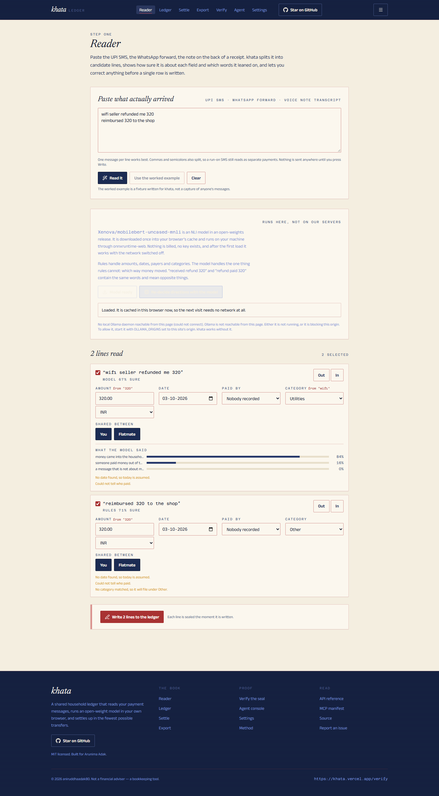
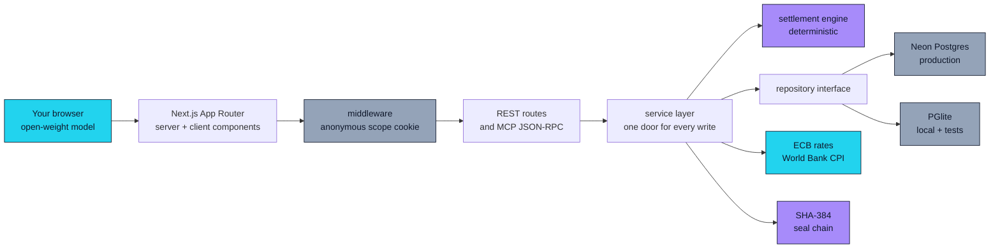
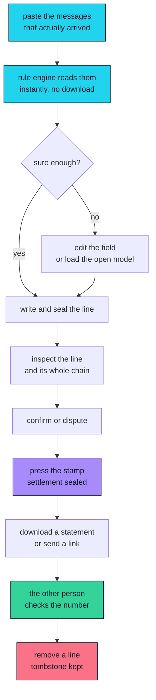
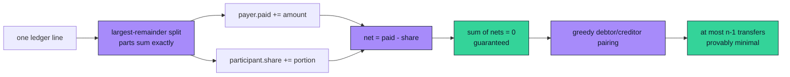
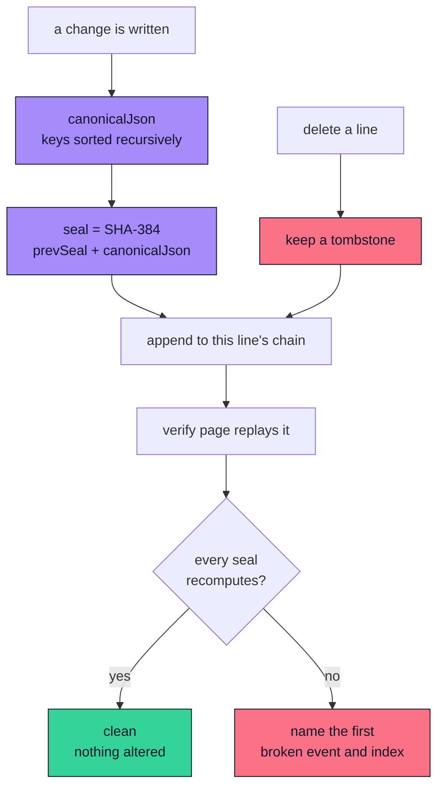
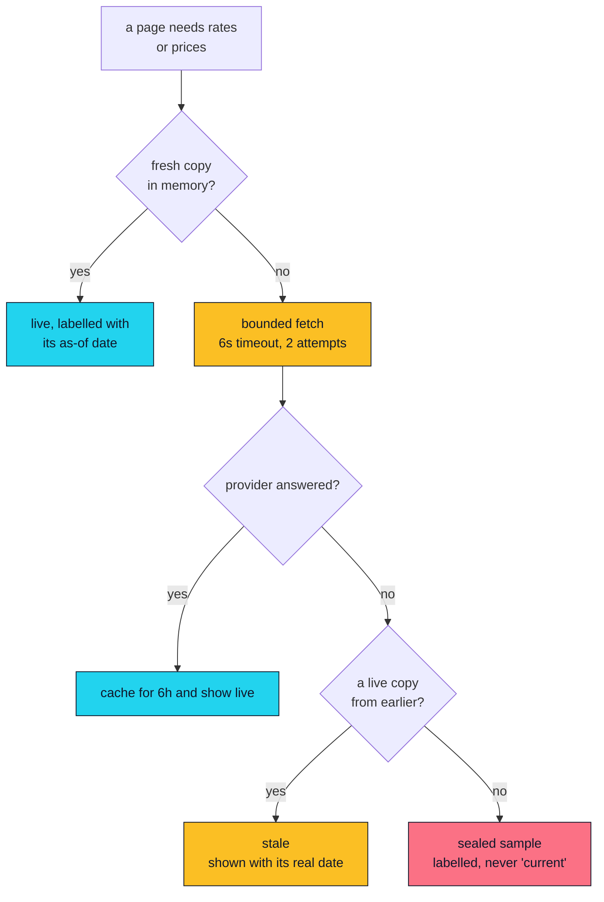

# khata

**The household ledger that reads your payment messages and settles up in the fewest possible transfers.**

Built for **Arunima Adak**, who shares a flat and loses the thread of who paid for what.

[](https://khata-ai.vercel.app)
[](https://nextjs.org)
[](https://www.typescriptlang.org)
[](LICENSE)
[](https://api.frankfurter.app)
[](public/mcp.json)
[](https://huggingface.co/Xenova/mobilebert-uncased-mnli)

**[Live app](https://khata-ai.vercel.app) · [Source](https://github.com/aniruddhaadak80/khata) · [Agent endpoint](https://khata-ai.vercel.app/mcp.json) · [Issues](https://github.com/aniruddhaadak80/khata/issues)**

---

A shared home produces one specific, boring, weekly problem. The electricity bill arrives as a
screenshot. Someone paid it. Three weeks later nobody can remember who covered what, and the
electricity bill is now an argument.

khata reads the messages that home actually produces — UPI SMS, WhatsApp forwards, the note on the
back of a receipt — turns them into a real ledger, keeps the original text as evidence, works out
the shortest way to settle up, and seals every change so the number can be *checked* instead of
believed.

There is **no account, no API key and no install**. The book belongs to the browser you open it in.



<sub>The reader with `Xenova/mobilebert-uncased-mnli` loaded and running locally. Captured by
`e2e/model.spec.ts` — the same run that asserts the model answered `inflow`, that the row became
writable, and that the line the rules already read at 0.90 was left alone.</sub>

---

## ✨ Features

- **The Reader reads real messages.** Paste a UPI SMS or a WhatsApp forward. A deterministic rule
  engine reads it instantly, with no download and no network, and tells you how sure it is about
  *each field* and which words it leaned on. It shows you the lines it could not read rather than
  dropping them.
- **An open-weight model runs in your browser.** [`Xenova/mobilebert-uncased-mnli`](https://huggingface.co/Xenova/mobilebert-uncased-mnli)
  — a 28 MB int8 NLI model — is loaded once into your browser's cache and executed through
  `onnxruntime-web`. It decides the one thing rules cannot: *which way the money moved*.
  `received refund 320` and `refund paid 320` contain the same words and mean opposite things.
- **Live money, honestly dated.** Exchange rates come from the European Central Bank via
  [Frankfurter](https://api.frankfurter.app) and consumer prices from
  [World Bank Open Data](https://data.worldbank.org/indicator/FP.CPI.TOTL), both keyless. Every
  figure is stamped with its status — `live`, `stale` or `fallback` — and its as-of date. A sealed
  sample is never dressed up as a live quote.
- **A settlement in the fewest possible transfers.** The beam tilts by the book's real imbalance,
  and the transfer plan provably uses the minimum number of payments the balances allow. The count
  and the bound are both shown, so the claim can be audited.
- **A trust score you can read.** Six weighted factors that sum to exactly 1, each showing the
  quantity it measured, in its own units, and one sentence explaining why it reads that way.
- **Every change is sealed.** Per line, a chain of `SHA-384` over canonical JSON. The verify page
  replays the whole book and names the exact event that no longer matches. Deleting a line keeps a
  tombstone so the chain stays provable.
- **An agent that uses the same door.** A live MCP-style JSON-RPC 2.0 endpoint with eleven typed
  tools. The mutating ones call the same service layer the interface calls — there is no
  agent-only write path.
- **A shareable statement.** Mint an unguessable link that renders a read-only settlement anyone
  can open. It is `noindex`, excluded from `robots.txt`, and warns you before it is created.

---

## 🚀 Quickstart

Requires **Node 20.9+**. Nothing else.

```bash
git clone https://github.com/aniruddhaadak80/khata.git
cd khata
npm install
npm run dev
```

Open <http://localhost:3000>. **Zero environment variables are required.** With no `DATABASE_URL`
the app runs on an embedded [PGlite](https://pglite.dev) Postgres in the process, and no upstream
needs a key.

### Quality commands

```bash
npm run typecheck   # tsc --noEmit, strict
npm run lint        # eslint
npm test            # 161 unit and integration tests (vitest)
npm run build       # production build
npm run check       # all four in sequence

npm run build && npm run start   # then, in another shell:
npm run test:e2e                  # Playwright: the primary journey in a real browser
```

The browser suite also contains one test that is **skipped by default**: it downloads the real 28 MB
of model weights and runs inference in Chromium, which makes the run depend on the Hugging Face CDN.
Run it on purpose, against a fresh build so you are testing what would actually ship:

```bash
npm run build
KHATA_MODEL_E2E=1 npx playwright test e2e/model.spec.ts   # macOS/Linux
$env:KHATA_MODEL_E2E="1"; npx playwright test e2e/model.spec.ts   # PowerShell
```

It takes a couple of minutes. It is the only thing in this repository that proves the open-weights
model works rather than merely being wired up, and the screenshot near the top of this file is
written by that run.

### Production environment variables

Documented without values in [`.env.example`](.env.example):

| Variable | Required | Purpose |
| --- | --- | --- |
| `DATABASE_URL` | **in production only** | Hosted Postgres. Neon, Vercel Postgres, Supabase — any will do. |
| `DATABASE_SCHEMA` | no | Table namespace, when one Postgres instance is shared. |
| `SITE_URL` | no | Canonical origin for metadata, OpenGraph, the sitemap and `public/mcp.json`. |

> In production khata **refuses to start** without `DATABASE_URL` rather than silently using an
> embedded database, which would lose every line on the next cold start. `/api/health` reports
> which adapter answered.

> There is deliberately **no `LLM_API_KEY` variable.** The model runs in your browser, or against a
> local Ollama at `127.0.0.1:11434`. Nothing is billed. Do not add one.

### Running a model on your own machine

The reader detects a local [Ollama](https://ollama.com) daemon and says plainly whether it found
one. To use an open-weights model locally:

```bash
ollama pull gemma3:1b
```

Then allow the site's origin and the reader will use it:

```bash
OLLAMA_ORIGINS="https://your-khata-host" ollama serve
```

A browser cannot reach `127.0.0.1` on your machine from a deployed site without that, so when the
probe fails khata says exactly that — including why — instead of offering a button that quietly
does nothing.

---

## 🔌 API

Every response uses one envelope: `{ ok: true, data }` or `{ ok: false, error: { code, message, fields? } }`.

### Create a line, then read it back

```bash
BASE=http://localhost:3000

# 1. read a message the way the interface does
curl -s $BASE/api/parse -H 'content-type: application/json' -d '{
  "text": "Paid 2400 to BESCOM, Arunima paid half\nreceived refund 320 from the wifi seller"
}' | jq '.data.candidates[] | { text, dir: .direction.value, amount: .amountMinor.value }'

# 2. write one line
curl -s -X POST $BASE/api/entries -H 'content-type: application/json' -d '{
  "occurredOn": "2026-10-02",
  "direction": "outflow",
  "amountMinor": 240000,
  "currency": "INR",
  "category": "utilities",
  "rawText": "Paid 2400 to BESCOM",
  "status": "draft"
}' | jq '{id: .data.entry.id, seal: .data.sealShort, fx: .data.fx.status}'

# 3. read it back — note the base amount and the captured rate
curl -s $BASE/api/entries?limit=5 | jq '.data.items[] | { occurredOn, amountMinor, amountBaseMinor, fxRateToBase, status }'
```

### Update, decide, delete

```bash
ID=<the id from step 2>

# edit
curl -s -X PATCH $BASE/api/entries/$ID -H 'content-type: application/json' \
  -d '{"note":"september electricity"}' | jq '.data.sealShort'

# decide — this is what changes who owes what, and it is sealed
curl -s -X PATCH $BASE/api/entries/$ID -H 'content-type: application/json' \
  -d '{"status":"confirmed"}' | jq '.data.sealShort'

# soft delete: the row is kept as a tombstone so the chain still replays
curl -s -X DELETE $BASE/api/entries/$ID | jq '{deleted: .data.deleted, tombstone: .data.tombstone.kept}'
```

### Engine, feeds and integrity

```bash
curl -s "$BASE/api/settlement?windowDays=30" | jq '{
  score: .data.settlement.score,
  verdict: .data.settlement.verdict,
  transfers: .data.settlement.transferCount,
  minimal: .data.settlement.minimalTransfers,
  seal: .data.settlement.seal,
  factors: [.data.settlement.factors[] | {id, weight, normalized}]
}'

curl -s $BASE/api/rates | jq '{fx: .data.fx.status, asOf: .data.fx.asOf, usd: .data.fx.rates.USD}'
curl -s $BASE/api/verify | jq '{ok: .data.ok, chains: .data.chains, events: .data.events}'
curl -s "$BASE/api/export?format=csv" -o statement.csv
```

### Errors are specific

| Status | Code | When |
| --- | --- | --- |
| `404` | `NOT_FOUND` | No such line, or not yours. |
| `422` | `VALIDATION_FAILED` | Field-level detail in `error.fields`. |
| `422` | `VALIDATION_FAILED` | A currency the ECB does not publish and no manual rate supplied. |
| `429` | `RATE_LIMITED` | Anonymous write throttle. `Retry-After` is set. |
| `503` | — | `/api/health` only, when the production store check fails. |

---

## 🤖 Agent interface

Live MCP-style **JSON-RPC 2.0** over HTTP POST at
[`POST /api/mcp`](https://khata-ai.vercel.app/api/mcp). Manifest:
[`public/mcp.json`](public/mcp.json).

```bash
BASE=http://localhost:3000

curl -s -X POST $BASE/api/mcp -H 'content-type: application/json' \
  -d '{"jsonrpc":"2.0","id":1,"method":"initialize","params":{"protocolVersion":"2025-06-18"}}' | jq .result.serverInfo

curl -s -X POST $BASE/api/mcp -H 'content-type: application/json' \
  -d '{"jsonrpc":"2.0","id":2,"method":"tools/list"}' | jq '[.result.tools[] | {name, kind}]'

curl -s -X POST $BASE/api/mcp -H 'content-type: application/json' -d '{
  "jsonrpc":"2.0","id":3,"method":"tools/call",
  "params":{"name":"analyse_settlement","arguments":{"windowDays":30}}
}' | jq '.result.structuredContent | {score, transferCount, minimalTransfers}'

# a mutating tool, idempotent on retry
curl -s -X POST $BASE/api/mcp -H 'content-type: application/json' -d '{
  "jsonrpc":"2.0","id":4,"method":"tools/call",
  "params":{"name":"record_entry","arguments":{
    "occurredOn":"2026-10-02","direction":"outflow","amountMinor":125000,
    "currency":"INR","category":"utilities","rawText":"paid via the console",
    "idempotencyKey":"demo-key-0001"}}
}' | jq '.result.structuredContent | {id: .entry.id, seal: .sealShort}'
```

**Eleven tools.** Read: `get_khata_summary`, `list_entries`, `get_entry`. Analysis:
`read_message`, `analyse_settlement`. Mutating: `record_entry`, `record_entries`, `decide_entry`,
`delete_entry`, `export_statement`, `create_share_link`.

Every mutating tool accepts an `idempotencyKey`, so an agent that retries after a timeout does not
double-charge anybody — the agent console demonstrates this by pressing record twice.

Because khata has no accounts, an agent acts inside the same browser session as the person whose
ledger it is reading. That is a deliberate consequence of not asking anyone to sign up.

---

## 📁 Project map

### User routes

| Route | What it is for | Writes |
| --- | --- | --- |
| `/` | The book this was built for, and a real computed verdict | — |
| `/reader` | Paste messages; read them; correct them; write lines | `POST /api/reader/commit` |
| `/ledger` | The book: filter, sort, page, confirm, dispute, remove | `PATCH` / `DELETE /api/entries/[id]` |
| `/ledger/new` | One line by hand, through the same conversion and sealing | `POST /api/entries` |
| `/ledger/[id]` | One line: its evidence, its split, its whole chain | `PATCH` / `DELETE` |
| `/settle` | The beam, the factors, the flags, and what to do next | `POST /api/settlement` (the stamp) |
| `/export` | Download in three formats, or mint a statement link | `POST /api/share` |
| `/verify` | Replay every chain; report the first broken link | — |
| `/agent` | Live JSON-RPC console with the raw wire visible | via `/api/mcp` |
| `/settings` | Members, base currency, data provenance, the method | `PATCH /api/household` |
| `/statement/[token]` | Read-only statement for whoever holds the link | — |

### API routes

| Endpoint | Methods | Responsibility |
| --- | --- | --- |
| `/api/health` | GET | Real persistence probe; reports the adapter and the feed status |
| `/api/rates` | GET | Normalised ECB rates and World Bank CPI, with status and as-of date |
| `/api/parse` | POST | The deterministic reader, the same function the browser uses |
| `/api/entries` | GET, POST | Filtered, sorted, paginated read; validated write |
| `/api/entries/[id]` | GET, PATCH, DELETE | One line plus its replayed chain; soft delete with a tombstone |
| `/api/reader/commit` | POST | Commit up to 50 candidates, reporting partial success honestly |
| `/api/settlement` | GET, POST | The engine; the stamp, which writes a sealed settlement event |
| `/api/export` | GET | Markdown, CSV or JSON statement, from one shared builder |
| `/api/share` | POST | Mint an unguessable statement link |
| `/api/verify` | GET | Replay every chain for this owner |
| `/api/household` | GET, PATCH | Members, currency, country |
| `/api/mcp` | GET, POST | JSON-RPC 2.0: `initialize`, `tools/list`, `tools/call` |

### Libraries

| File | Responsibility |
| --- | --- |
| `src/lib/types.ts` | The domain, plus normalised external shapes |
| `src/lib/money.ts` | Integer minor units and the largest-remainder split |
| `src/lib/reader.ts` | The deterministic reader |
| `src/lib/local-model.ts` | The in-browser open-weight model, and the Ollama probe |
| `src/lib/engine.ts` | `analyseSettlement` — balances, transfers, factors, flags |
| `src/lib/integrity.ts` | Canonical JSON, SHA-384 sealing, replay |
| `src/lib/fx.ts` | Live feeds, sealed fallback, provenance |
| `src/lib/repository.ts` | Two adapters, one typed interface |
| `src/lib/service.ts` | The one service layer UI, REST and MCP all call |
| `src/lib/statement.ts` | One builder for all three export formats |
| `src/lib/scope.ts`, `src/middleware.ts` | Anonymous ownership |

---

## 🏗 Architecture



There is exactly **one** service layer. The browser, the REST routes and the eleven MCP tools all
call the same functions, because the product's central claim is that an agent and a person see the
same book — and a claim like that rots the moment a second write path appears.

### The user journey



---

## 🧮 The deterministic engine

`khata-engine/1.0.0`. One pure function, `analyseSettlement`, behind the Settle page,
`GET /api/settlement` and the `analyse_settlement` tool.

**The accounting model.** For every line the payer's `paid` rises by the amount and each
participant's `share` rises by their portion. Then `net = paid − share`, and a positive net means
the household owes that person. An inflow follows the same rule, because receiving a refund on the
household's behalf is arithmetically identical to fronting the money and recovering it — and each
line keeps its own direction label, so what the message actually said is never hidden.



**Why the transfer count is minimal.** Every transfer clears at least one outstanding balance and
the last clears two, so from *n* non-zero balances no plan can use fewer than *n − 1* transfers. The
greedy pairing always pairs a debtor with a creditor, so it reaches that bound. khata reports the
count *and* whether the bound held.

**The six factors**, whose weights sum to exactly 1:

| Factor | Weight | What it measures |
| --- | --- | --- |
| Evidence | 0.22 | Share of lines keeping a message or a receipt |
| Confirmation | 0.20 | Share agreed — confirmed 1, draft 0.35, disputed 0 |
| Freshness | 0.16 | Mean line age, full marks for today, zero at twice the window |
| Read confidence | 0.16 | Mean certainty of whichever reader wrote the line |
| Rate discipline | 0.14 | Foreign lines converted within 2% of today's published rate |
| Dispute load | 0.12 | One minus the disputed share |

An empty window scores **0**, not "nothing is wrong". Rate discipline and dispute load both read 1
on an empty book by construction, which would otherwise hand a household with nothing recorded a
score of 26 that looks like "mostly fine". There is no book to trust when there is no book.

Tie-breaking is total everywhere — amounts descending, then member id ascending — so two people
running the page independently get the same answer.

---

## 🔗 Integrity and seal replay



```
seal_n = SHA-384( UTF-8(prevSeal) || canonicalJson(event_n) )
```

Canonical JSON sorts object keys **recursively**, because otherwise a harmless refactor that
reordered two fields would look exactly like tampering and every replay would fail. Ordering breaks
ties on the event id, because a timestamp alone is not a total order — two events written in the
same millisecond would otherwise replay differently depending on row order, which would make the
replay irreproducible.

Chains are **per entity**. Each line's history starts from genesis and is independent of every
other line's, and the household is an entity too, so settlements and share-link mints are chained
with it. A delete keeps a tombstone, so "it existed and was removed" stays provable.

The digests are pinned to hand-computed vectors in `tests/integrity.test.ts`, so the check is
reproducible rather than merely green.

---

## 📡 Data provenance and the offline path



| Source | What | Key | Used for |
| --- | --- | --- | --- |
| [Frankfurter](https://api.frankfurter.app) | ECB reference rates, 29 currencies | none | Converting a foreign line, checking rate drift |
| [World Bank Open Data](https://data.worldbank.org/indicator/FP.CPI.TOTL) | Consumer price index, annual | none | Context for what a rupee is worth |

A foreign line stores the rate that was true **on the day it was written**, so it never silently
re-prices itself when the ECB publishes. The rate-discipline factor flags any line whose captured
rate has drifted more than 2% from today's.

A currency the ECB does not publish — AED, for instance — is **refused** rather than converted at
1:1. You can supply the rate you used, and the line records that you did.

**Fallback data never replaces user data.** A sealed sample can fill in a rate; it can never touch
a ledger line.

---

## 🛡 Security and privacy

- **No accounts.** Ownership is an unguessable 24-byte scope in an HTTP-only, `SameSite=Lax`
  cookie, minted in `src/middleware.ts`. The server never trusts an owner id in a request body.
- **Every read is owner-scoped.** Including the audit log — an unscoped `SELECT` there would return
  every household's sealed history, with their members' names and amounts inside each event's
  payload. `listAudit(ownerId, chainId?)` makes that impossible to express.
- **The cookie's `secure` flag follows the request protocol**, not `NODE_ENV`. A `Secure` cookie sent
  over plain HTTP is silently dropped by the client, which would mean a new scope, a new household
  and an empty book on every single request.
- **Rate limits are best-effort and labelled as such.** Writes are throttled by an in-memory token
  bucket — 20 burst, 12 per minute sustained, per scope and per client IP. On serverless this
  protects one warm instance and nothing more. For a real deployment put a hosted limiter in front
  and keep this as the application-level backstop. `x-forwarded-for` is treated as one signal among
  several, never as an identity.
- **Statements are private.** `noindex`, `nofollow`, disallowed in `robots.txt`, expiring, and
  gated only by the token's 192 bits of entropy. The interface warns you before minting one.
- **Everything is validated.** Zod at every boundary, parameterised SQL throughout, and external
  fetches restricted to two allowlisted origins.
- **Parameterised, not interpolated.** The only identifier interpolated into SQL is the schema name,
  validated against `^[a-z_][a-z0-9_]{0,62}$` first.
- **What is stored:** ledger lines and amounts, the original message text, and sealed audit
  events. No password, no card number, no document image. No analytics, no third-party script.
- Secrets never appear in client bundles, the repository, public manifests or error responses.
  Errors return a code and a message, never a stack trace or an environment variable.

---

## 🚢 Deployment

```mermaid
flowchart LR
  Push["push to main"] --> CI["GitHub Actions<br/>Node 22, npm ci"]
  CI --> Gate["typecheck, lint,<br/>161 tests, build"]
  Gate --> Deploy["Vercel production build"]
  Deploy --> Env["DATABASE_URL<br/>+ SITE_URL"]
  Env --> Health["/api/health must<br/>report neon-postgres"]
  Health --> Verify["verify:live<br/>12-point proof"]
  Verify --> Repo["gh repo edit<br/>topics, homepage"]

  classDef infra fill:#94a3b8,stroke:#0f172a,color:#0f172a
  classDef ok fill:#34d399,stroke:#0f172a,color:#0f172a
  classDef risk fill:#fb7185,stroke:#0f172a,color:#0f172a
  class CI,Deploy,Env infra
  class Health,Verify ok
  class Gate risk
```



The schema is created on first use, once per process. A cold start pays fourteen idempotent
`CREATE ... IF NOT EXISTS` statements; after that the process remembers — running them per request
added seconds to every page and was caught by measuring, not by reading the code.

```bash
npm run verify:live   # reads KHATA_BASE_URL, uses real HTTP, prints a pass/fail table
```

---

## 🗺️ Roadmap

### Now — shipped

- [x] **The Reader** — paste real messages, per-field confidence and evidence, correct anything.
  *You can hand it a screenshot of a conversation and get a ledger.*
- [x] **The open model** — MobileBERT NLI in the browser, re-deciding only the directions rules
  were unsure about. *Your ambiguous lines get a second opinion without leaving your machine.*
- [x] **Settlement** — the beam, the minimum-transfer plan, six audited factors.
  *You can send someone the shortest possible answer to "so what do I owe you?"*
- [x] **Seals and replay** — per-line SHA-384 chains with a verify page that names a break.
  *A disagreement can be settled by replaying the record instead of by argument.*
- [x] **The agent interface** — eleven typed tools over the one service layer.
  *An assistant can file a receipt into your book without a bespoke integration.*

### Next

- [ ] **Statement PDF.** *The settlement becomes something you can put on the table.* One page,
      the transfer plan, the seal, no screenshot needed.
- [ ] **Multi-household switching.** *Somebody in two flats can keep two books.* A scope can own
      several households with an explicit switcher, instead of exactly one.
- [ ] **Split-by-weights in the UI.** *Two people who eat differently can split the groceries
      honestly.* The engine already accepts weights; the interface does not yet expose them.
- [ ] **Ollama as a first-class engine.** *A laptop with a local model can do proper extraction,
      not just direction.* The probe exists; the extraction path is not wired end to end.

### Later

- [ ] **Receipt photo import.** *Photograph a bill, get a line.* On-device OCR feeding the reader,
      so the image never leaves the phone.
- [ ] **Recurring lines.** *Rent stops being retyped every month.* A template that seeds a line on
      the first of each month, still sealed and still disputable.
- [ ] **Export to a real accountancy format.** *A shared home that becomes a business can hand its
      books to an accountant.* SEPA-like and Tally-compatible CSV shapes.

---

## 🤝 Contributing

Issues and pull requests are welcome, especially ones that find a case the reader gets wrong — the
interesting bugs are all in the seams between two halves of a sentence.

```bash
npm run check          # typecheck, lint, tests, build
npm run build && npm run start
npm run test:e2e       # the primary journey in a real browser
```

If you change the reader, the engine or the seal, please keep the tests honest: the digest
vectors are hand-computed, and a test that has been updated to match new behaviour is worth less
than the one that was broken.

## 📄 License

[MIT](LICENSE) © 2026 aniruddhaadak80.

## ⚠️ Not financial advice

khata is a bookkeeping tool. It records what people in one household tell it and computes the
arithmetic between those records. It is not a financial adviser, it does not tell you what to buy,
and a settlement it produces is an agreement between two people rather than a judgement about money.

## 🙏 Credits

- **Arunima Adak**, for the problem. This was built for a specific person, not a persona.
- [European Central Bank](https://www.ecb.europa.eu) via [Frankfurter](https://api.frankfurter.app),
  keyless reference rates.
- [World Bank Open Data](https://data.worldbank.org) for the consumer price index.
- [`Xenova/mobilebert-uncased-mnli`](https://huggingface.co/Xenova/mobilebert-uncased-mnli),
  Apache-2.0, run through [`@huggingface/transformers`](https://github.com/huggingface/transformers.js).
- Type by [Newsreader](https://fonts.google.com/specimen/Newsreader),
  [Anek Latin](https://fonts.google.com/specimen/Anek+Latin) and
  [Azeret Mono](https://fonts.google.com/specimen/Azeret+Mono) — all SIL Open Font License.